# Turismo Lobería - Frontend React + Vite

Este proyecto es el frontend de un sitio turístico para el partido de Lobería (Provincia de Buenos Aires), desarrollado en **React**. Incluye componentes de navegación, footer, clima, buscador con sugerencias, descarga de archivos y seguimiento de eventos con Google Analytics 4.

---

## 📁 Estructura de carpetas
src/

├─ assets/ # Imágenes, íconos y logos

├─ components/

│ ├─ cards/ # Componentes de tipo card (WeatherCardCompact, etc.)

│ ├─ common/ # Helpers y utilidades compartidas

│ ├─ buttons/ # Botones especiales (DownloadButton)

│ ├─ Navbar/ # Componente Header/Navbar

│ ├─ Footer/ # Componente Footer

│ ├─ WeatherCarousel/ # Carrusel de clima

├─ helpers/ # Helpers globales

│ └─ Global.js

├─ analytics/ # Google Analytics 4

│ └─ ga.js

├─ styles/ # CSS/SCSS globales

├─ App.js

├─ index.js

└─ i18n.js # Configuración de react-i18next


---

## 🔧 Instalación

# 1. Clonar el repositorio:

```bash
git clone https://github.com/Luca1008/Turismo-Loberia.git
cd turismoloberia

2. Instalar dependencias
npm install

3. Ejecutar la aplicación:
npm run dev
```

# 2. Dependencias principales

* React 18

* react-router-dom 6

* react-icons

* axios

* react-i18next

* bootstrap

* typewriter-effect

* react-ga4


# 3. Funcionalidades principales
## 1. Header / Navbar

* Navegación principal con enlaces a secciones y submenús desplegables.

* Cambio de idioma (ES / EN) usando react-i18next.

* Buscador de contenidos con sugerencias dinámicas.

* Menú responsive para desktop y dispositivos móviles.

* Integración con Google Analytics para rastreo de clics.

* Clima de Localidades.

## 2. Footer

Contiene logo, enlaces de contacto, dirección y redes sociales.

Componente responsive.

Seguimiento de eventos en enlaces con Google Analytics.

Cambia el idioma automáticamente según selección del usuario.

## 3. Páginas de las localidades Lobería, Arenas Verdes y San Manuel

Cada página tiene: Información general, cómo llegar, alojamientos. gastronmía, transporte, agenda, qué hacer y descarga de folletería.

## 4. Cards

Cards reutilizables que contienen información de acontenicimientos y alojamientos de las distintas localidades.

## 5. Información del clima

Carrusel de clima para las localidades.

Consulta datos de clima desde API Openweathermap.

Pausa automática al pasar el mouse por encima.

Cada tarjeta muestra ciudad, temperatura, ícono y descripción del clima.

Soporta múltiples ubicaciones configurables.

Además, página con el clima extendido para cada localidad.

## 6. Buscador con sugerencias

Filtra resultados por título y categoría.

Autocompletado dinámico basado en contenido disponible.

Compatible con desktop y mobile.

Permite navegar directamente a la página de resultados.

## 6. Google Analytics 4

Inicialización de GA con ReactGA.

Seguimiento de páginas (trackPageview) y eventos (trackEvent).

Integración en botones, enlaces y cambios de idioma.

Permite análisis de interacción de usuarios.

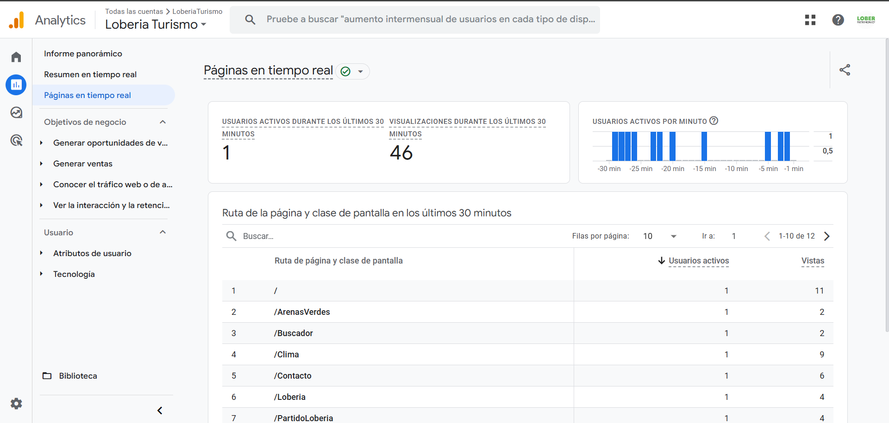

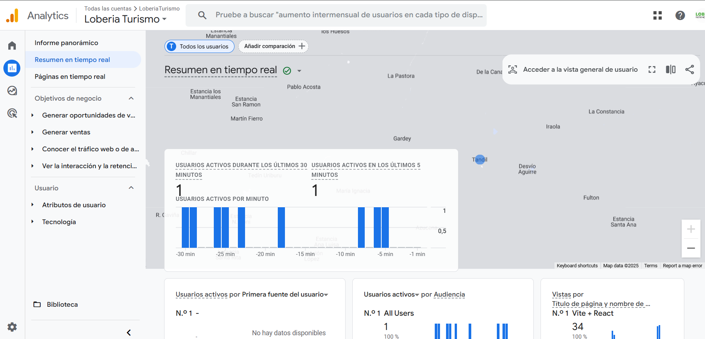

## 7. Internacionalización

Traducciones usando react-i18next.

Todos los textos clave, menús y etiquetas son traducibles.

Cambio dinámico de idioma desde Navbar y Footer.

## 8. Herramientas de Accesibilidad

Permite cambiar el tamaño del texto, fuente dislexia, modo oscuro, subrayar enlaces y leer contenido de la página.

Ejemplo de modo oscuro:


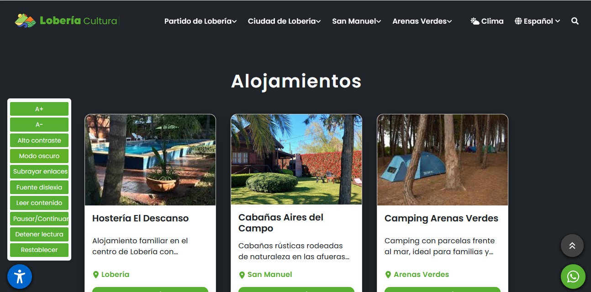

## 5. Botones reutilizables

# Botón Download

Botón reutilizable para descargar archivos.

Configurable: filePath, fileName, label y className.

Ícono de descarga integrado con react-icons.

# Botón Submit
Botón reutilizable para envío de formularios.

## 8. Panel Admin

Panel de administración para crear, editar y eliminar contenido. Además de editar y crear información de editores.
* Login para Superadmin y Admins con recuperación de contraseña


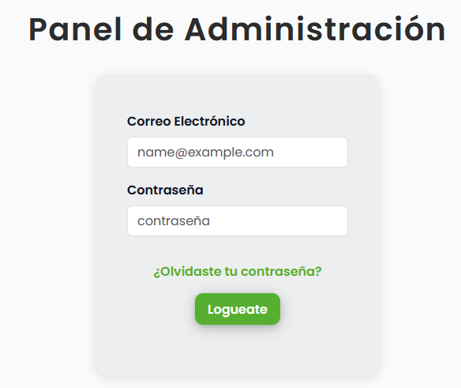


* Buscador de contenido, cards con botones editar y eliminar incorporados para mejorar la experiencia de usuario. Clickear en los botones correspondientes para scrollear hacia los formularios de edición / creación.


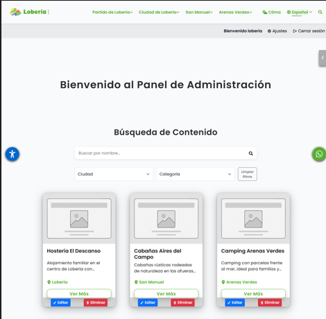


* - Formulario para creación de Cards


* - Formulario para edición de Cards


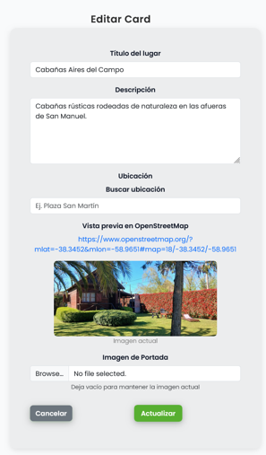


* Formulario para modificar imágenes del carrousel de página principal con check para dejar imágenes por defecto.

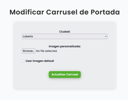

* Formulario para enviar contenido a suscriptores


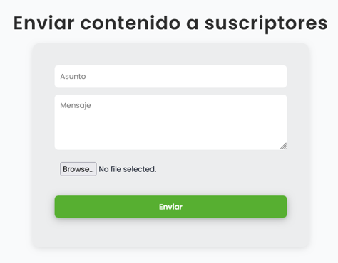

* Dashboard con gráficos estadísticos con preferencias de suscriptores

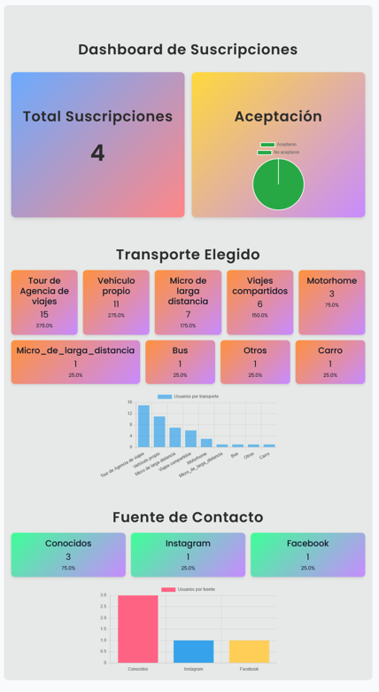

* Botón de acceso rápido a secciones del panel admin

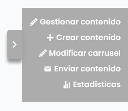


* Ajustes de perfil/es
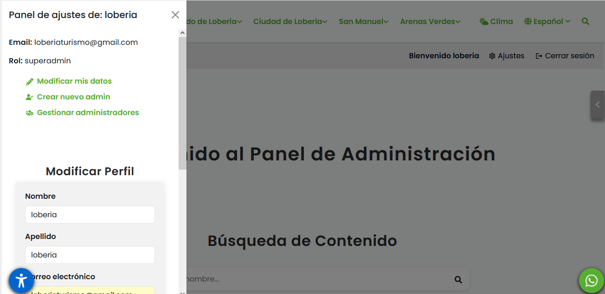

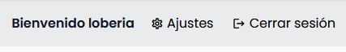

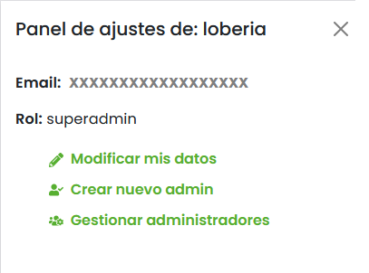


📝 Notas importantes

Todos los componentes son responsivos y adaptativos para dispositivos móviles.

La API de clima debe estar disponible en la URL definida en Global.url.

Se recomienda ejecutar la aplicación en un entorno local para pruebas de GA antes de producción.

Las rutas y enlaces están gestionados con react-router-dom 6.

# Turismo Lobería - Backend API

API para la gestión de contenido turístico del partido de Lobería (Provincia de Buenos Aires).

Desarrollada en **Node.js**, **Express**, **PostgreSQL**, con autenticación JWT, envío de emails, gestión de usuarios, cards, carousel y suscripciones.

---

# 1. Instalación
```bash
Clonar repositorio:

git clone https://github.com/usuario/turismo-loberia.git
cd backend


Instalar dependencias:

npm install


Ejecutar la aplicación:

npm start

```
## Diagrama de rutas


## Ejemplos de uso
**Registro de usuario**

 * POST /api/user/register
{
  "name": "Juan",
  "surname": "Pérez",
  "email": "juan@mail.com",
  "password": "123456",
  "role": "admin"
}

* Respuesta 201:
{
  "status": "success",
  "user": {
    "id": 1,
    "name": "Juan",
    "surname": "Pérez",
    "email": "juan@mail.com",
    "role": "admin"
  }
}

**Crear Card**

* POST /api/cards (con imágenes)

* - Payload multipart/form-data:

* - card_title: "Playa Lobería"

* - card_description: "Lugar turístico..."

* - card_city: "Lobería"

* - card_img: archivo imagen

* - card_img_portada: archivo imagen portada

* Respuesta 201:

{
  "card": {
    "id": 10,
    "card_title": "Playa Lobería",
    "card_description": "Lugar turístico...",
    "card_city": "Lobería"
  }
}

**Suscripciones**

* POST /api/subscriptions
{
  "name": "María",
  "email": "maria@mail.com",
  "phone": "12345678",
  "project": "Turismo Lobería",
  "accept": true
}

* Respuesta 201:
{
  "message": "Suscripción creada exitosamente",
  "data": {
    "id": 1,
    "name": "María",
    "email": "maria@mail.com"
  }
}


**Utils - Enviar Email**

* POST /api/send-email
{
  "name": "Juan",
  "email": "juan@mail.com",
  "subject": "Consulta",
  "message": "Hola, quiero info"
}

* Respuesta 200:
{
  "message": "Correo enviado exitosamente."
}


**Auth Middleware**

* - Todos los endpoints de actualización y eliminación de usuarios requieren JWT Bearer Token.

* - Token se genera al login:
{
  "token": "eyJhbGciOiJIUzI1NiIsInR5cCI6IkpXVCJ9..."
}


## Middlewares

* - auth: Autenticación JWT

* - upload: Manejo de archivos con multer

* - errorHandler: Manejo centralizado de errores

* - validators: Validación de inputs con express-validator

## Validaciones

* - registerValidators: Registro de usuario

* - loginValidators: Login usuario
 
* - updateUserValidators: Actualizar usuario

## Modelo de Usuario

* - create(), updateById(), deleteAdminById()

* - findById(), findByEmail()

* - findAll(), findAdmins(), findSuperadmin()

* - updateResetToken(), clearResetToken()

* - updatePasswordById()

## Tests

* - Se utilizan Jest y Supertest.
```bash
npm test
```

**Test GET /api/cards-all:**
it('debería responder con un array de cards', async () => {
  const res = await request(app).get('/api/cards-all');
  expect(res.statusCode).toBe(200);
  expect(Array.isArray(res.body)).toBe(true);
});


-------------------------------------------

 # 👨‍💻 Autores

 * - Felicitas Aguerralde

* - Luca Guidi

📄 Licencia

> ©️ **Copyright All Rights Reserved**. Copyright (c) 2025 Turismo Lobería.
> Todos los derechos reservados. 
> Queda prohibida la copia, distribución, modificación o uso de este software sin autorización expresa del autor.

 * Componente `Readme`
 * Readme de la aplicación
 * @component
 * @author Felicitas Aguerralde
 * @author Luca Guidi
 * @returns {JSX.Element}

## Documentación: JSDoc con Minami

## 📚 Documentación

La documentación completa del proyecto está disponible en la carpeta [`doc`](./doc).  
Allí encontrarás guías de uso, referencias de API, y detalles técnicos para desarrolladores y administradores.

> **Ruta:** `/doc`

## 📄 Archivos relevantes

En la carpeta [`archivos_relevantes`](./archivos_relevantes) se encuentran:

- **Requerimientos del sitio:** Documento con los requisitos funcionales y técnicos del proyecto.
- **Manual de usuario del Panel Admin:** Guía detallada para el uso y administración del panel de control.

> **Ruta:** `/archivos_relevantes`